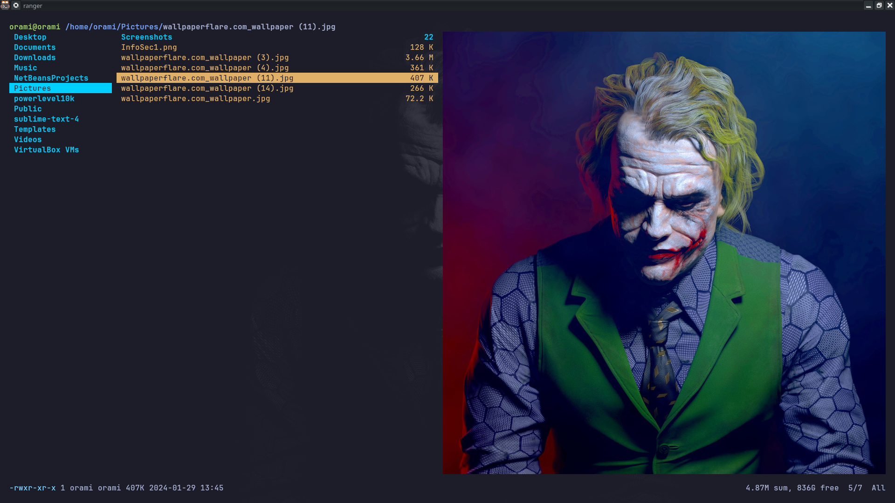
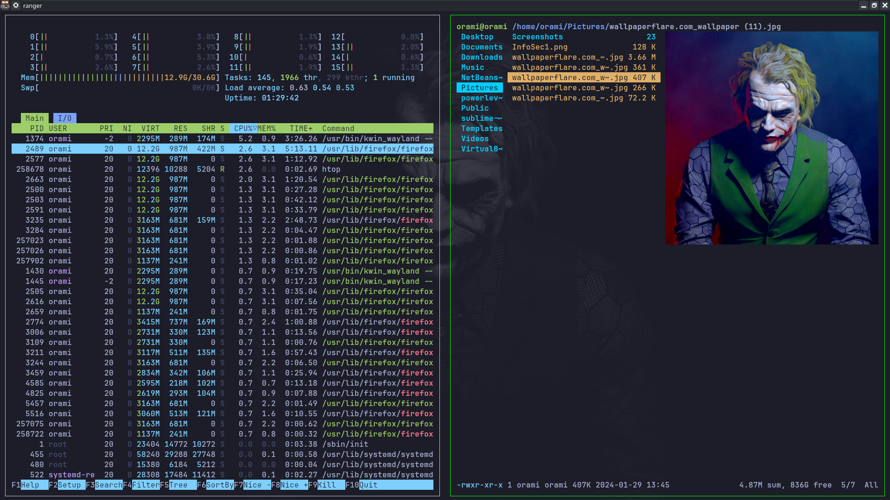
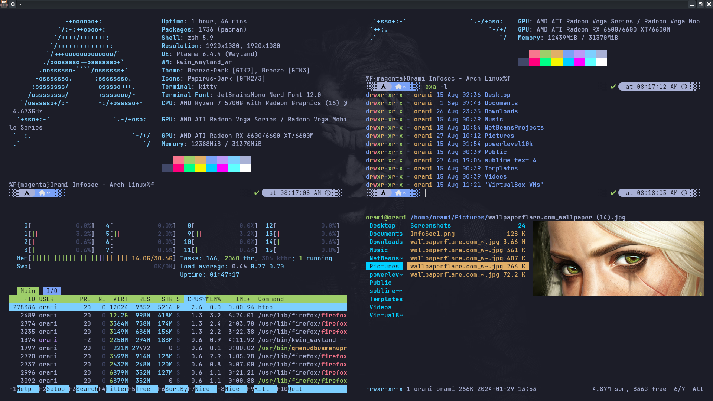
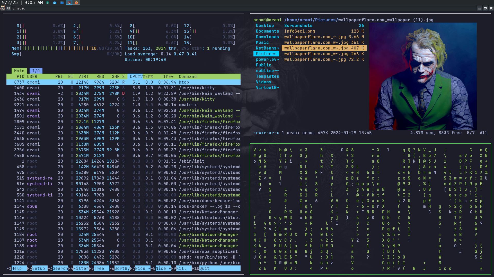

# kitty.config

A clean, customized configuration for the [Kitty terminal emulator](https://sw.kovidgoyal.net/kitty/),
themed **Cyberpunk Sakura**. Built for Arch Linux with Powerlevel10k,
Nerd Fonts, and a fully commented config file for easy customization.

---

## Screenshots






---

## Features

- Cyberpunk Sakura color scheme based on Tokyo Night.
- JetBrainsMono Nerd Font with icon support for eza and Powerline.
- Powerline tab bar with slanted separators.
- Semi-transparent background with hot-reload opacity control.
- Inactive window dimming for split layouts.
- Custom keybindings for splits, tabs, copy/paste, and opacity.
- No inline comments — fully compatible with Kitty's config parser.

---

## Requirements

| Tool | Purpose |
|---|---|
| [Kitty](https://sw.kovidgoyal.net/kitty/) | Terminal emulator |
| [JetBrainsMono Nerd Font](https://www.nerdfonts.com/) | Font with icon support |
| [Powerlevel10k](https://github.com/romkatv/powerlevel10k) | Zsh prompt theme |

Install the font on Arch Linux:

```bash
sudo pacman -S ttf-jetbrains-mono-nerd
```

---

## Installation

**1. Back up your current config:**
```bash
cp ~/.config/kitty/kitty.conf ~/.config/kitty/kitty.conf.bak
```

**2. Copy the new config:**
```bash
cp kitty.config ~/.config/kitty/kitty.conf
```

**3. Reload Kitty without closing it:**
```
ctrl+shift+f5
```

---

## Keybindings

| Action | Shortcut |
|---|---|
| Copy | `ctrl+shift+c` |
| Paste | `ctrl+shift+v` |
| New split window | `ctrl+shift+enter` |
| Close window | `ctrl+shift+w` |
| Next window | `ctrl+shift+]` |
| Previous window | `ctrl+shift+[` |
| New tab | `ctrl+shift+t` |
| Close tab | `ctrl+shift+q` |
| Next tab | `ctrl+shift+right` |
| Previous tab | `ctrl+shift+left` |
| Increase opacity | `ctrl+shift+a` → `m` |
| Decrease opacity | `ctrl+shift+a` → `l` |
| Full opacity | `ctrl+shift+a` → `1` |
| Reset opacity | `ctrl+shift+a` → `d` |

---

## License

MIT# kitty.config
kitty.config
